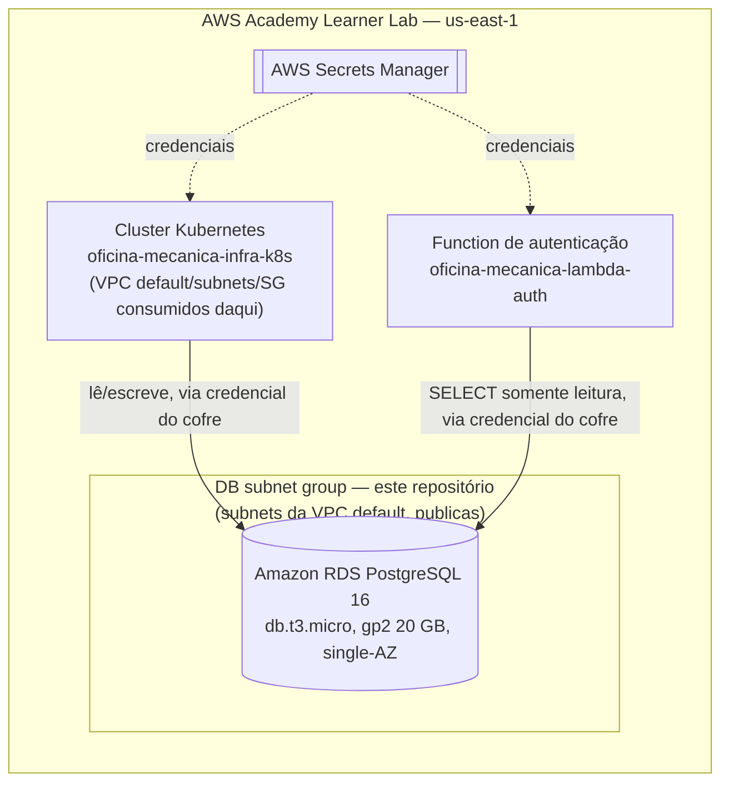

# oficina-mecanica-infra-db

Terraform do banco de dados gerenciado do **Sistema de Oficina Mecânica** — Tech Challenge da
pós-graduação em Arquitetura de Software (FIAP/SOAT), Fase 3.

> **Estado atual: implementado, não aplicado.** O Terraform do RDS PostgreSQL está escrito e passa
> em `fmt`/`validate`, mas ainda não rodou `plan`/`apply` — depende de duas coisas que só existem
> na sessão do Learner Lab: credenciais AWS e o state (ainda inexistente) do repositório
> `oficina-mecanica-infra-k8s`, do qual este repositório consome a VPC. Ver
> [Decisões e pontos em aberto](#decisões-e-pontos-em-aberto).

---

## Índice

- [Propósito](#propósito)
- [Tecnologias utilizadas](#tecnologias-utilizadas)
- [Diagrama do componente](#diagrama-do-componente)
- [Contrato de outputs](#contrato-de-outputs)
- [Pré-requisitos](#pré-requisitos)
- [Instruções de execução](#instruções-de-execução)
- [Passos de deploy](#passos-de-deploy)
- [Explicação da pipeline](#explicação-da-pipeline)
- [Custo estimado e ordem de destruição](#custo-estimado-e-ordem-de-destruição)
- [Decisões e pontos em aberto](#decisões-e-pontos-em-aberto)

---

## Propósito

Provisionar, via Terraform, o **banco de dados gerenciado** (Amazon RDS PostgreSQL 16) que
substitui o PostgreSQL em pod usado na Fase 2: subnet group privado, security group liberando
apenas o cluster Kubernetes (`oficina-mecanica-infra-k8s`) e a Function de autenticação
(`oficina-mecanica-lambda-auth`), backup/retention curto, e as credenciais publicadas no AWS
Secrets Manager — nunca em texto puro.

## Tecnologias utilizadas

| Tecnologia | Uso |
|---|---|
| **Terraform** ≥ 1.5 | IaC do banco gerenciado e da rede/segurança ao redor dele |
| **GitHub Actions** | CI de validação (`fmt` + `validate`) em Pull Request e `apply` em push na `main` |
| **AWS** (Learner Lab) | Amazon RDS PostgreSQL 16, Secrets Manager, security group — ver RFC-002 para as restrições da conta |

## Diagrama do componente



## Contrato de outputs

### Consumidos (de `oficina-mecanica-infra-k8s`, via `terraform_remote_state`)

Este repositório não cria VPC nem subnets — ele lê o state de `oficina-mecanica-infra-k8s`
(key `infra-k8s/terraform.tfstate`, no mesmo bucket compartilhado, ver `variables.tf` /
`remote_state.tf`) e assume que aquele repositório exporta, no mínimo:

| Output esperado | Uso aqui |
|---|---|
| `vpc_id` | `vpc_id` do security group do RDS |
| `private_subnet_ids` | subnets do `aws_db_subnet_group` |
| `cluster_security_group_id` | origem liberada na regra de ingress 5432 (cluster EKS) |

`vpc_id` e `private_subnet_ids` agora vêm da **VPC default** da conta (`oficina-mecanica-infra-k8s`
não cria mais VPC própria — ver RFC-002 e o README daquele repositório). O nome
`private_subnet_ids` foi mantido por estabilidade do contrato entre os dois repositórios, mas as
subnets em si são públicas. Isso não expõe o banco: `aws_db_instance.this.publicly_accessible =
false` (`rds.tf`) já impede endereço público, e o security group dedicado (`aws_security_group.rds`,
`network.tf`) só libera a porta 5432 a partir do security group do cluster EKS — nunca da internet.
Avaliamos usar o DB subnet group `default` que a AWS cria automaticamente para toda VPC default, em
vez de criar um (`aws_db_subnet_group.this`); optamos por manter a criação própria porque preserva
o contrato de outputs já documentado (`private_subnet_ids`) sem depender de um nome de recurso
implícito da conta, cuja existência não temos como confirmar sem `apply`.

Esse é o ponto mais provável de quebra entre os dois repositórios: se `infra-k8s` renomear ou
remover algum desses outputs, o `plan` deste repositório falha ao resolver os data sources.

A security group da Function `oficina-mecanica-lambda-auth` **não** tem, ainda, um contrato formal
via `terraform_remote_state` — não existe hoje um repositório de infraestrutura Terraform para a
Lambda. Por isso ele entra como variável (`lambda_security_group_id`, `variables.tf`), a ser
informada manualmente (ou via secret/variável de CI) quando esse SG existir.

### Expostos (para quem consumir o state deste repositório, key `infra-db/terraform.tfstate`)

| Output | Sensível? | Conteúdo |
|---|---|---|
| `db_endpoint` | não | `host:port` do RDS |
| `db_address` | não | hostname do RDS |
| `db_port` | não | porta (5432) |
| `db_name` | não | nome do banco inicial (`oficina_mecanica`) |
| `db_secret_arn` | não | ARN do secret no Secrets Manager — a senha em si nunca é um output |
| `db_security_group_id` | não | id do security group do RDS |

Nenhum output carrega a senha: ela é gerada por `random_password` e só existe no
`aws_secretsmanager_secret_version` (`secrets.tf`), lido em runtime pela aplicação/Lambda via
Secrets Manager.

## Pré-requisitos

- [Terraform](https://developer.hashicorp.com/terraform/downloads) ≥ 1.5
- Para `plan`/`apply` (não para `validate`): credenciais temporárias de uma sessão ativa do AWS
  Academy Learner Lab (`AWS_ACCESS_KEY_ID`, `AWS_SECRET_ACCESS_KEY`, `AWS_SESSION_TOKEN`) e um
  bucket S3 já existente para o backend do state.

## Instruções de execução

Validação estática, sem credencial — a mesma que a pipeline roda em todo Pull Request:

```bash
terraform init -backend=false
terraform fmt -check -recursive
terraform validate
```

Para `plan`/`apply` reais (feito por quem tiver uma sessão ativa do Learner Lab), o backend é
parcial de propósito — nenhum bucket está hardcoded em `main.tf` — então o `init` precisa dos
valores via `-backend-config`:

```bash
terraform init \
  -backend-config="bucket=<bucket-do-state-compartilhado>" \
  -backend-config="key=infra-db/terraform.tfstate" \
  -backend-config="region=us-east-1"

terraform plan \
  -var="infra_k8s_state_bucket=<mesmo-bucket-acima>"

terraform apply \
  -var="infra_k8s_state_bucket=<mesmo-bucket-acima>"
```

`infra_k8s_state_bucket` é obrigatória (sem default) — ver [Contrato de outputs](#contrato-de-outputs).
`lambda_security_group_id` é opcional; sem ela, a regra de ingress para a Lambda simplesmente não é
criada (ver `network.tf`).

## Passos de deploy

1. PR com o Terraform (este repositório já está nesse estado).
2. CI roda `terraform fmt -check` + `terraform validate` — status check obrigatório da `main`.
3. Merge em `main`.
4. Job `apply` do workflow roda automaticamente em push na `main` (ou por `workflow_dispatch`, para
   reexecutar após renovar as credenciais da sessão sem precisar de um novo commit), usando
   `aws-actions/configure-aws-credentials` com os três secrets temporários do Learner Lab.

Ordem de dependência real: como este repositório **consome** a VPC/subnets/SG do cluster via
`terraform_remote_state` (ver [Contrato de outputs](#contrato-de-outputs)), `oficina-mecanica-infra-k8s`
precisa ser aplicado **antes** deste repositório, não depois — a frase anterior deste README (agora
corrigida) invertia essa ordem.

## Explicação da pipeline

Workflow em [`.github/workflows/ci.yml`](.github/workflows/ci.yml), GitHub Actions:

- **Em Pull Request** (job `validate`): `terraform fmt -check -recursive`, `terraform init
  -backend=false` e `terraform validate`. É o **status check obrigatório** da branch `main` — sem
  ele passar, o PR não pode ser mergeado.
- **Em push na `main` ou `workflow_dispatch`** (job `apply`, depende de `validate`): configura
  credenciais AWS temporárias via `aws-actions/configure-aws-credentials` (secrets
  `AWS_ACCESS_KEY_ID`, `AWS_SECRET_ACCESS_KEY`, `AWS_SESSION_TOKEN` — o `AWS_SESSION_TOKEN` é
  obrigatório porque o Learner Lab só emite credenciais temporárias), inicializa o backend com
  `-backend-config` (variável de repositório `TF_STATE_BUCKET`) e roda `terraform apply
  -auto-approve`. `workflow_dispatch` existe especificamente para permitir reexecutar o apply
  depois de renovar as credenciais da sessão, sem precisar de um commit novo.

## Custo estimado e ordem de destruição

Ambiente efêmero (RFC-002 §6.3): provisionar, validar/gravar a demonstração e destruir — não manter
no ar entre sessões. O que cobra por hora mesmo com a aplicação parada:

| Recurso | Custo aproximado | Observação |
|---|---|---|
| RDS PostgreSQL (`db.t3.micro`, 20 GB gp2) | Instância On-Demand + armazenamento | Cobra enquanto a instância existir, mesmo sem conexões. Uma instância **parada** é religada automaticamente pela AWS após 7 dias (RFC-002 §6.3) — parar não é uma forma de reduzir custo por muito tempo; `destroy` é. |
| Secrets Manager (`aws_secretsmanager_secret.db`) | ~US$ 0,40/mês por secret | Baixo, mas contínuo enquanto o secret existir. `recovery_window_in_days = 0` faz o `destroy` remover o secret imediatamente, sem janela de retenção. |

**Ordem de destruição:** este repositório (`infra-db`) **antes** de `oficina-mecanica-infra-k8s`.
Este repositório consome VPC/subnets/security group do `infra-k8s` via `terraform_remote_state`;
destruir o `infra-k8s` primeiro deixaria o RDS órfão (rede/SG apontando para recursos inexistentes)
e o `terraform destroy` deste repositório provavelmente falharia ao tentar resolver o remote state.

```
destroy: oficina-mecanica-infra-db  →  oficina-mecanica-infra-k8s
apply:   oficina-mecanica-infra-k8s →  oficina-mecanica-infra-db
```

## Decisões e pontos em aberto

- **Sem Dockerfile.** A orientação oficial da fase é incluir `Dockerfile` só onde for tecnicamente
  necessário; um repositório composto apenas de Terraform não roda nada em contêiner. Decisão, não
  esquecimento.
- **`plan`/`apply` não foram executados nesta entrega.** Esta sessão não tem credenciais AWS ativas.
  `terraform validate` passa porque data sources e o `terraform_remote_state` só são resolvidos no
  `plan`. Falta validar, quando a sessão do Learner Lab estiver ativa e `infra-k8s` já tiver sido
  aplicado: (1) se os nomes de output realmente batem com o contrato assumido; (2) se a
  engine_version do PostgreSQL (agora fixada só na major version, `16` — ver `variables.tf`) resolve
  corretamente em `us-east-1`; (3) se
  `storage_encrypted = true` (`rds.tf`) funciona com a chave gerenciada `aws/rds` — deveria funcionar
  numa conta padrão, mas é um ponto de falha possível numa conta restrita como o Learner Lab; se
  falhar, desligar é uma linha; (4) o `apply` de ponta a ponta.
- **`lambda_security_group_id` como variável, não remote state.** Não existe hoje um repositório de
  infraestrutura Terraform para `oficina-mecanica-lambda-auth` com um output formal para consumir —
  ver [Contrato de outputs](#contrato-de-outputs).
- **Ambiente de homologação**: em aberto (ver ADR-005 do repositório da aplicação) — depende do
  crédito disponível na conta de nuvem usada no projeto.
